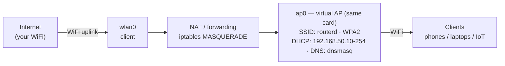

<div align="center">

<h1 align="center">routerd</h1>

<p align="center">Turn any Linux machine with a Wi-Fi card into a <b>Wi-Fi access point + router</b> with a single command.</p>

<p align="center">
  
  
  
  
</p>

</div>

```sh
sudo systemctl start routerd
```

Nearby devices instantly see a network named `routerd` (configurable) and, once
connected, get internet access shared from your machine's existing Wi-Fi
connection. No extra hardware needed — it runs on the **same** Wi-Fi card that
is already connected to your network.

- Written in Go, single static binary, zero dependencies.
- Access point (hostapd) + DHCP/DNS (dnsmasq) + NAT (iptables) all managed
  together with clean start/stop.
- WPA2-PSK password support (or open network).
- Auto-follows the channel of your current Wi-Fi connection.

## How it works



The driver (mac80211) lets one card act as a **station (client)** and an
**access point** at the same time. The only constraint is that both must use
the **same radio channel**, so `routerd` picks the AP channel automatically
from your current connection (`CHANNEL=auto`).

## Requirements

- Linux with a Wi-Fi card whose driver supports concurrent STA + AP
  (check with `iw list` → `valid interface combinations`).
- Packages:
  - **Arch Linux**: `sudo pacman -S hostapd dnsmasq iw wireless-regdb`
  - **Debian/Ubuntu**: `sudo apt install hostapd dnsmasq iw wireless-regdb`
    (On Ubuntu, enable the `universe` repository — `hostapd` is in it.)

## Install

```sh
git clone https://github.com/muadzhdz/routerd
cd routerd
make build          # optional, builds the binary
sudo ./install.sh                 # binary + config + systemd unit only
sudo ./install.sh --with-deps     # ... plus hostapd/dnsmasq/iw/wireless-regdb (auto-detect pacman/apt)
```

This installs:

- `/usr/local/bin/routerd` — the daemon
- `/etc/routerd.conf` — configuration
- `/etc/systemd/system/routerd.service` — systemd unit
- `/etc/NetworkManager/conf.d/90-routerd.conf` — keeps the AP interface unmanaged

## Configure

Edit `/etc/routerd.conf`:

```ini
SSID=routerd            # network name
PASSWORD=changeme       # WPA2 password (8-63 chars), empty = open
CHANNEL=auto            # auto = follow your Wi-Fi's channel
INTERFACE_AP=ap0        # virtual AP interface name
SUBNET=192.168.50.0/24  # client subnet
COUNTRY=ID              # your ISO 3166-1 country code
MAX_CLIENTS=16
```

## Usage

```sh
sudo systemctl start routerd     # turn on the access point
sudo routerd status              # SSID, channel, connected clients
sudo systemctl reload routerd    # apply SSID/password/channel/subnet changes
sudo systemctl restart routerd   # full restart (recreates the AP interface)
sudo systemctl enable routerd    # start automatically on boot
sudo systemctl stop routerd      # turn it off (cleans everything up)
```

Or run it directly (foreground):

```sh
sudo routerd -c /etc/routerd.conf start
```

## Troubleshooting

| Symptom | Likely cause / fix |
| --- | --- |
| `hostapd exited during startup` | AP mode not supported by the driver. Check `iw list` for `AP` under "Supported interface modes". See `/run/routerd/hostapd.log`. |
| `no associated wireless client interface found` | The machine is not connected to any Wi-Fi. Connect first, or set `INTERFACE_STA`. |
| AP does not appear / no internet | `CHANNEL=auto` picks your Wi-Fi's channel; make sure you are connected. On 5 GHz avoid DFS channels (52–64, 100–140). |
| 5 GHz does not work | Set a valid `COUNTRY` and install `wireless-regdb`. |
| Windows refuses to connect | We use WPA2 (`wpa=2`), which is the most compatible. |
| Slow speeds | One radio is shared between client and AP; that's normal for this setup. |

## Limitations

- The AP shares the radio (and channel) with your Wi-Fi connection.
- Only 2 interfaces total (1 STA + 1 AP) — this is a driver limit.
- Requires root; designed primarily for systemd-based distros.

## License

[MIT](LICENSE)
